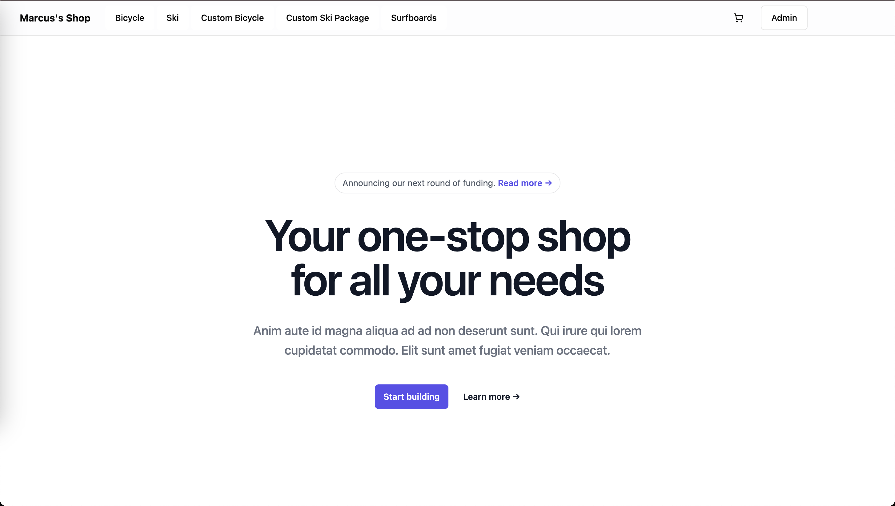
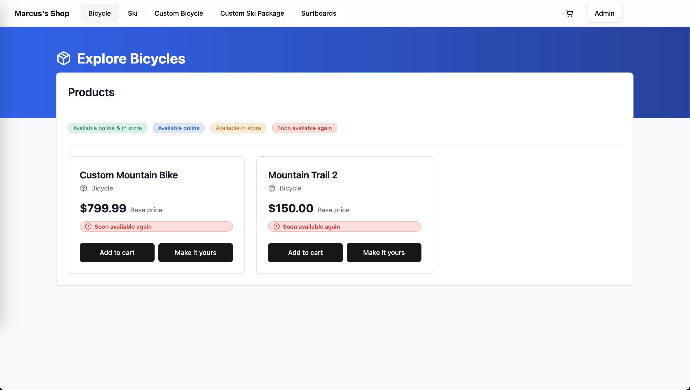
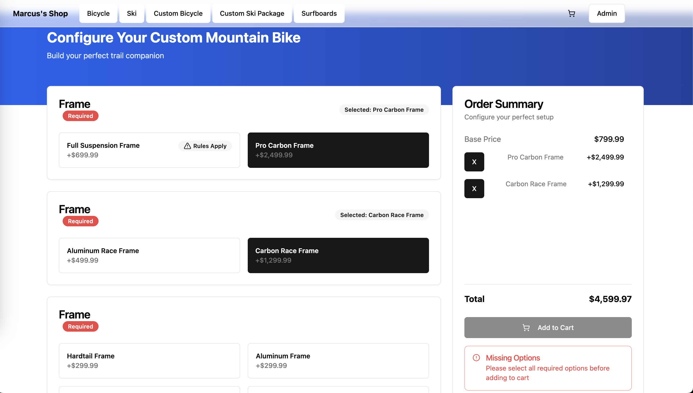
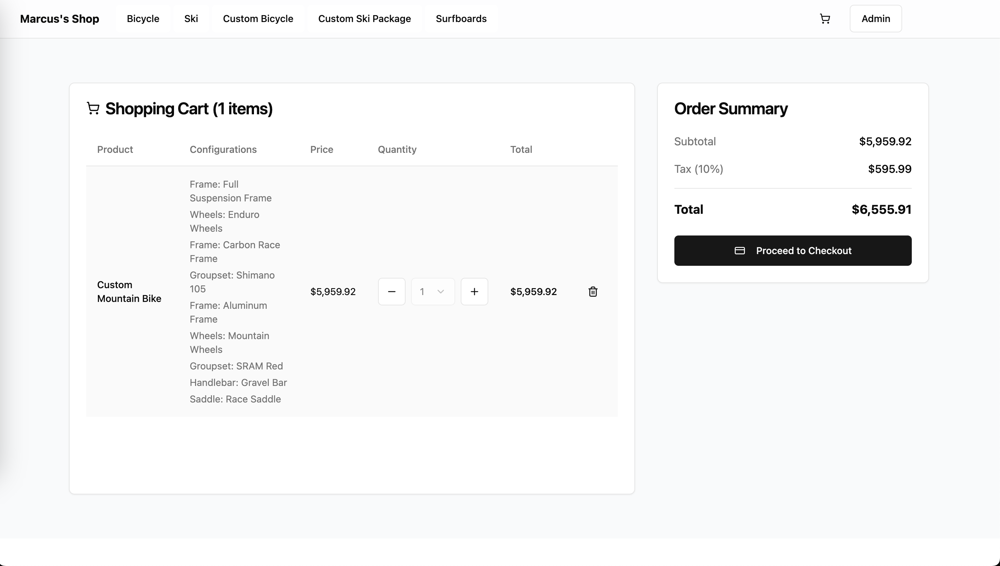
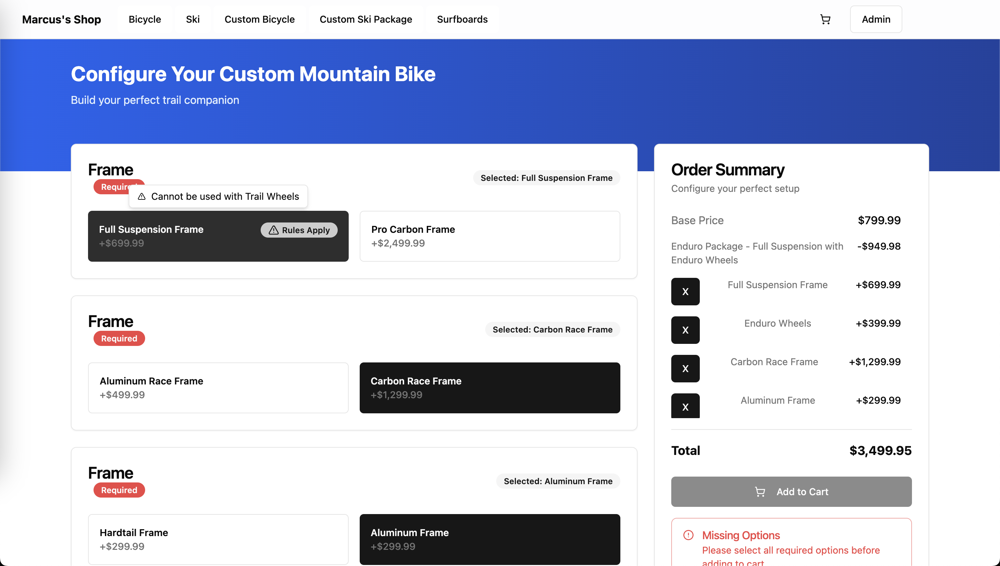
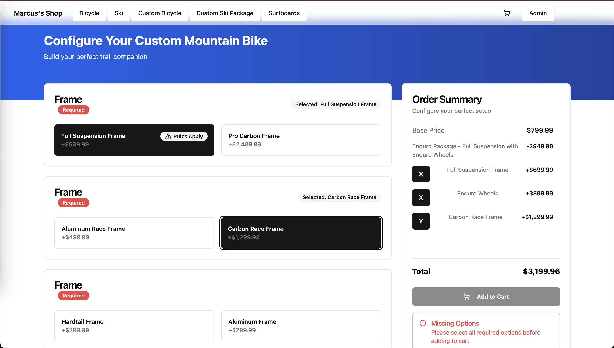
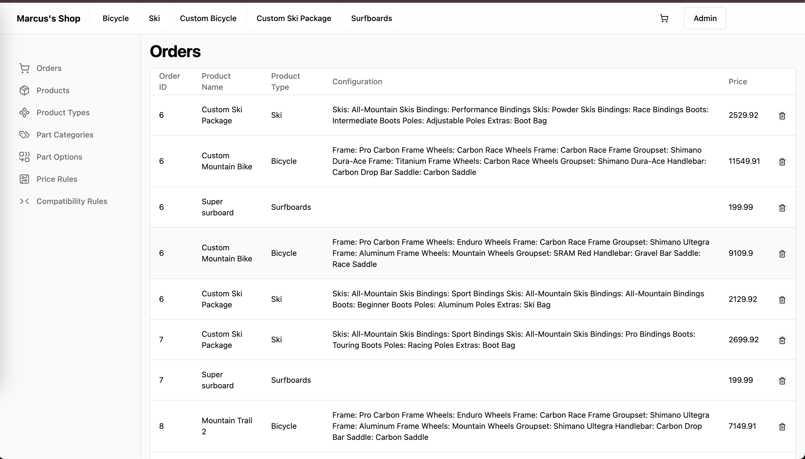
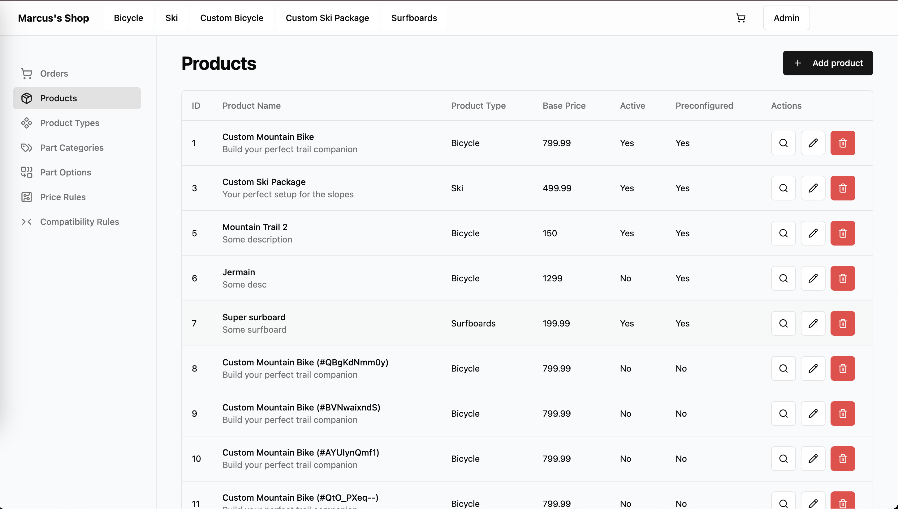
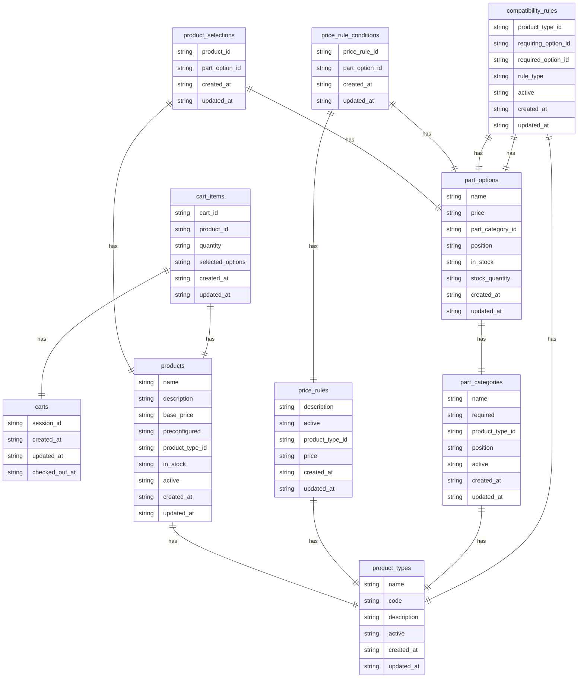

# Marcus's Bicycle Shop

## Project Overview

A customizable e-commerce platform for Marcus's Bicycle Shop, focusing on configurable products (initially bicycles)
with plans to expand to other sports equipment. The system handles complex product configurations, pricing rules, and
compatibility constraints.

## Key Requirements

- Fully customizable products with multiple configurable parts
- Support for complex pricing rules based on combinations
- Compatibility rules between different parts
- Stock management
- Extensible to support different product types
- Admin interface for product/inventory management


## Features
- Product types and part categories managed by admin.
- Pre-configured products for customization.
- Compatibility rules for part options.
- Dynamic navbar with all available product types.
- Full checkout and order management for admins.
- Price rule system for complex pricing.

## Screenshots










## System Design

### Architecture Overview
- API-Driven Design: GraphQL APIs for efficient communication between frontend and backend.
- Componentized Frontend: React components enable reusability and dynamic UI rendering.
- Database: Structured to handle complex relationships between products, parts, rules, and carts.

## Tech Stack

### Backend

- **Sinatra**: Lightweight Ruby framework for APIs.
- **Active Record**: ORM for database interactions.
- **GraphQL-Ruby**: Query language for efficient data fetching.
- **Testing Suite**: RSpec for unit and integration tests.

### Frontend

- **React**: JavaScript library for building UI components.
- **Shadcn**: CSS framework for design consistency.
- **Tailwind**: Utility-first CSS framework for rapid styling.
- **Apollo Client**: GraphQL client for data fetching.

## Setup Instructions

1. Clone the repository: `git clone https://github.com/christoandrew/bicycle_shop`
2. Install Ruby dependencies: `bundle install`
3. Start the backend: `bundle exec rerun puma`
4. Install Node dependencies: `cd client && npm install`
5. Start the frontend: `pnpm dev`
6. Open `http://localhost:5173` in your browser.

## Data Model Design

### Key Design Decisions

1. **Product Type Separation**
    - Separate ProductType model to support different product categories
    - Allows different configuration options per product type
    - Enable extension beyond bicycles

2. **Price Rule System**
    - Complex pricing handled through PriceRule and PriceRuleCondition
    - Supports multi-option pricing rules
    - Enables special pricing for specific combinations

3. **Compatibility System**
    - Bidirectional rules (requires/excludes)
    - Rules tied to product type for better organization
    - Flexible enough for complex constraints

### Core Entities



## Database Schema and Field Descriptions

Below are the tables and their fields:

### **cart_items**

- **cart_id**: Foreign key linking to `carts`.
- **product_id**: Foreign key linking to `products`.
- **quantity**: Number of items in the cart.
- **selected_options**: JSON representing selected options for the product.
- **created_at**: Timestamp when the cart item was created.
- **updated_at**: Timestamp when the cart item was last updated.

### **carts**

- **session_id**: Identifier for the user session.
- **created_at**: Timestamp when the cart was created.
- **updated_at**: Timestamp when the cart was last updated.
- **checked_out_at**: Timestamp when the cart was checked out.

### **compatibility_rules**

- **product_type_id**: Foreign key linking to `product_types`.
- **requiring_option_id**: Part option requiring compatibility.
- **required_option_id**: Part option that is compatible.
- **rule_type**: Type of rule (e.g., mandatory or exclusion).
- **active**: Boolean indicating if the rule is active.
- **created_at**: Timestamp when the rule was created.
- **updated_at**: Timestamp when the rule was last updated.

### **part_categories**

- **name**: Name of the part category.
- **required**: Boolean indicating if the category is required.
- **product_type_id**: Foreign key linking to `product_types`.
- **position**: Display order for the category.
- **active**: Boolean indicating if the category is active.
- **created_at**: Timestamp when the category was created.
- **updated_at**: Timestamp when the category was last updated.

### **part_options**

- **name**: Name of the part option.
- **price**: Price of the part option.
- **part_category_id**: Foreign key linking to `part_categories`.
- **position**: Display order for the option.
- **in_stock**: Boolean indicating if the option is in stock.
- **stock_quantity**: Number of items available.
- **created_at**: Timestamp when the option was created.
- **updated_at**: Timestamp when the option was last updated.

### **price_rule_conditions**

- **price_rule_id**: Foreign key linking to `price_rules`.
- **part_option_id**: Foreign key linking to `part_options`.
- **created_at**: Timestamp when the condition was created.
- **updated_at**: Timestamp when the condition was last updated.

### **price_rules**

- **description**: Description of the pricing rule.
- **active**: Boolean indicating if the rule is active.
- **product_type_id**: Foreign key linking to `product_types`.
- **price**: Price defined by the rule.
- **created_at**: Timestamp when the rule was created.
- **updated_at**: Timestamp when the rule was last updated.

### **product_selections**

- **product_id**: Foreign key linking to `products`.
- **part_option_id**: Foreign key linking to `part_options`.
- **created_at**: Timestamp when the selection was created.
- **updated_at**: Timestamp when the selection was last updated.

### **product_types**

- **name**: Name of the product type.
- **code**: Unique code for the product type.
- **description**: Description of the product type.
- **active**: Boolean indicating if the product type is active.
- **created_at**: Timestamp when the product type was created.
- **updated_at**: Timestamp when the product type was last updated.

### **products**

- **name**: Name of the product.
- **description**: Description of the product.
- **base_price**: Base price of the product.
- **preconfigured**: Boolean indicating if the product is preconfigured.
- **product_type_id**: Foreign key linking to `product_types`.
- **in_stock**: Boolean indicating if the product is in stock.
- **active**: Boolean indicating if the product is active.
- **created_at**: Timestamp when the product was created.
- **updated_at**: Timestamp when the product was last updated.## Database Schema and Field Descriptions

Below are the tables and their fields:

### **cart_items**

- **cart_id**: Foreign key linking to `carts`.
- **product_id**: Foreign key linking to `products`.
- **quantity**: Number of items in the cart.
- **selected_options**: JSON representing selected options for the product.
- **created_at**: Timestamp when the cart item was created.
- **updated_at**: Timestamp when the cart item was last updated.

### **carts**

- **session_id**: Identifier for the user session.
- **created_at**: Timestamp when the cart was created.
- **updated_at**: Timestamp when the cart was last updated.
- **checked_out_at**: Timestamp when the cart was checked out.

### **compatibility_rules**

- **product_type_id**: Foreign key linking to `product_types`.
- **requiring_option_id**: Part option requiring compatibility.
- **required_option_id**: Part option that is compatible.
- **rule_type**: Type of rule (e.g., mandatory or exclusion).
- **active**: Boolean indicating if the rule is active.
- **created_at**: Timestamp when the rule was created.
- **updated_at**: Timestamp when the rule was last updated.

### **part_categories**

- **name**: Name of the part category.
- **required**: Boolean indicating if the category is required.
- **product_type_id**: Foreign key linking to `product_types`.
- **position**: Display order for the category.
- **active**: Boolean indicating if the category is active.
- **created_at**: Timestamp when the category was created.
- **updated_at**: Timestamp when the category was last updated.

### **part_options**

- **name**: Name of the part option.
- **price**: Price of the part option.
- **part_category_id**: Foreign key linking to `part_categories`.
- **position**: Display order for the option.
- **in_stock**: Boolean indicating if the option is in stock.
- **stock_quantity**: Number of items available.
- **created_at**: Timestamp when the option was created.
- **updated_at**: Timestamp when the option was last updated.

### **price_rule_conditions**

- **price_rule_id**: Foreign key linking to `price_rules`.
- **part_option_id**: Foreign key linking to `part_options`.
- **created_at**: Timestamp when the condition was created.
- **updated_at**: Timestamp when the condition was last updated.

### **price_rules**

- **description**: Description of the pricing rule.
- **active**: Boolean indicating if the rule is active.
- **product_type_id**: Foreign key linking to `product_types`.
- **price**: Price defined by the rule.
- **created_at**: Timestamp when the rule was created.
- **updated_at**: Timestamp when the rule was last updated.

### **product_selections**

- **product_id**: Foreign key linking to `products`.
- **part_option_id**: Foreign key linking to `part_options`.
- **created_at**: Timestamp when the selection was created.
- **updated_at**: Timestamp when the selection was last updated.

### **product_types**

- **name**: Name of the product type.
- **code**: Unique code for the product type.
- **description**: Description of the product type.
- **active**: Boolean indicating if the product type is active.
- **created_at**: Timestamp when the product type was created.
- **updated_at**: Timestamp when the product type was last updated.

### **products**

- **name**: Name of the product.
- **description**: Description of the product.
- **base_price**: Base price of the product.
- **preconfigured**: Boolean indicating if the product is preconfigured.
- **product_type_id**: Foreign key linking to `product_types`.
- **in_stock**: Boolean indicating if the product is in stock.
- **active**: Boolean indicating if the product is active.
- **created_at**: Timestamp when the product was created.
- **updated_at**: Timestamp when the product was last updated.

## Main User Workflows

### Admin Workflows

#### 1. Product Configuration Page

- **Implementation**:
  ```javascript
  // React component using GraphQL
  const ProductConfigurator = ({ productId }) => {
    // Dynamic option loading
    // Price calculation
    // Compatibility checking
  }
  ```
- **Key Features**:
    - Real-time price updates
    - Dynamic option filtering
    - Stock availability checking

#### 2. Add to Cart Process

- Validates configuration completeness
- Checks stock availability
- Creates product record
- Adds to cart with quantity

### Admin Workflows

#### 1. Product Management

- Create new product types
- Configure product options
- Set base prices
- Manage stock levels

#### 2. Price Rule Management

- Set individual option prices
- Configure combination prices
- Define special pricing rules

#### 3. Compatibility Management

- Define required combinations
- Set excluded combinations
- Manage rule priorities


## Key Implementation Decisions

### 1. Price Calculation Strategy

```ruby

def calculate_price(selected_options)
  base_price = product.base_price
  rule_price = find_applicable_rules(selected_options)
  option_price = calculate_option_prices(selected_options)

  base_price + rule_price + option_price
end
```

- Handles complex pricing scenarios
- Maintainable and testable

### 2. Compatibility Engine

- Rule-based system
- Cached results for performance
- Handles circular dependencies


This architecture provides a robust foundation for Marcus's current needs while enabling future growth. The system is
designed to be maintainable, performant, and extensible, with careful consideration given to real-world usage patterns
and business requirements.